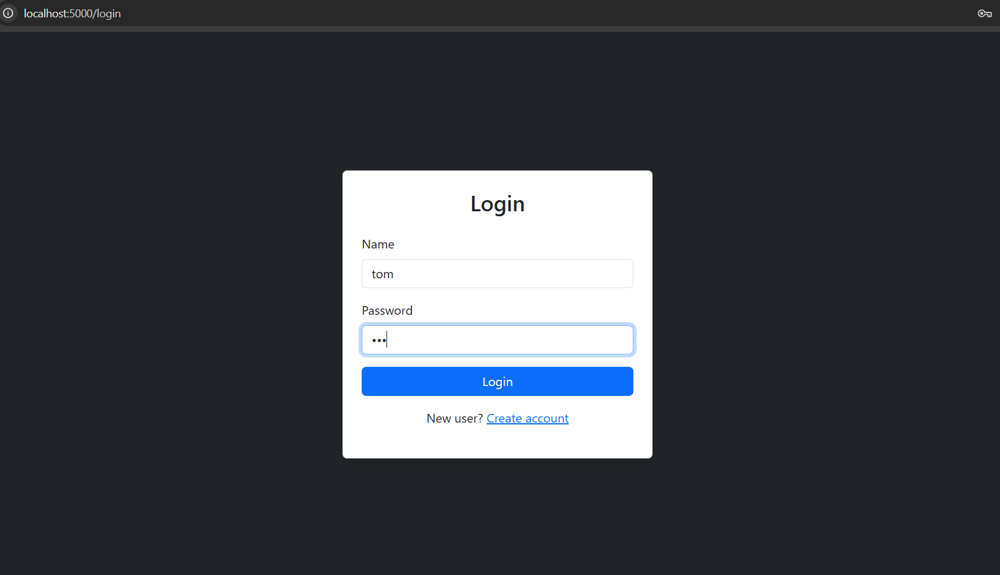

# Movie Ticket Booking System 🎬

A web-based movie ticket booking application developed using Node.js, Express.js, MongoDB, EJS, and Bootstrap.

## Features

- User Registration & Login
- Admin Movie Management
- Admin Show Management
- Ticket Booking
- Cancel Booking
- Booking History

## Tech Stack

- Node.js
- Express.js
- MongoDB
- EJS
- Bootstrap

## Screenshots

### Login Page

### Register Page

### Admin Dashboard

### View Movies

### User Dashboard

### Booking Page

## How to Run

- npm install
- npm start

Then open:

http://localhost:5000